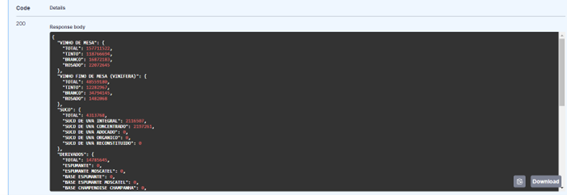
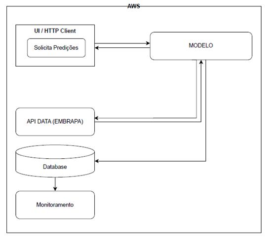

# Tech Challenge Fase 1 - MLE - Planos Futuros e Arquitetura

Nesse arquivo iremos falar brevemente sobre os principais pontos do desenvolvimento da API para consulta aos dados da Embrapa e como pensamos em utilizá-la futuramente para construção de um modelo a fim de aplicarmos as técnicas de machine learning.

## Autores

- Eduardo Aguiar Tofanello Lombardi
- Gustavo Santos Matos
- Gustavo Tonin 
- Lucas Abrahão de Paiva
- Tuany Grazyelli Gasparino Ribeiro

## Desenvolvimento API

A ideia do Tech Challenge foi desenvolver uma API que consumisse os endpoints da EMBRAPA e retornasse os valores disponibilizados nas tabelas HTML em um formato adequado para uma aplicação, geralmente em JSON. Esse desenvolvimento foi realizado utilizando a framework FastAPI, desenvolvida para Python, com o objetivo de trabalhar com REST APIs.

A API final apresenta apenas uma rota, exigindo como parâmetros a especificação de uma das abas do site da EMBRAPA e um ano válido. Após a requisição (REQUEST), a API processa os dados da tabela HTML disponível no site e os converte para o formato JSON, conforme mostrado na figura abaixo.

Esses dados serão utilizados para a construção e alimentação de um modelo de Machine Learning com o objetivo de prever uma determinada variável resposta. A predição gerada estará disponível para uma aplicação e para o monitoramento da performance do próprio modelo, visando identificar oscilações significativas na performance (o que pode demandar atualizações e retreinamentos) e possíveis intermitências.

## Próximos passos e aplicações

O plano de utilização da API é para desenvolver um modelo de predição utilizando técnicas de Machine Learning. Temos informações históricas sobre a produção de diversos produtos e dados de exportações de determinados países. O objetivo do modelo é utilizar esses dados históricos para prever, nos próximos anos, se a produção de um determinado produto atenderá às expectativas de exportação de um país específico. Assim, ao escolher um país e um produto, a API retornará a previsão da produção para a safra em questão e uma resposta adicional indicando se essa produção será suficiente para atender à demanda padrão do país selecionado.

Para implementar o modelo anterior, segue uma arquitetura simplificada do projeto realizado através da AWS, com as entidades e as requisições necessárias para o funcionamento do plano conforme idealizado.

