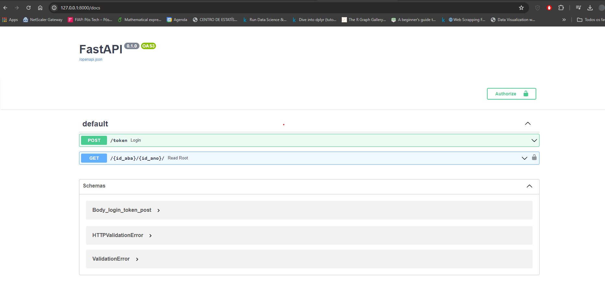

# Tech Challenge Fase 1 - MLE

O Projeto busca os dados no site da Embrapa, em seguida é feito o tratamento dos dados, no final é retornado um arquivo Json com os dados de forma organizada. 


## Autores

- Eduardo Aguiar Tofanello Lombardi
- Gustavo Santos Matos
- Gustavo Tonin 
- Lucas Abrahão de Paiva
- Tuany Grazyelli Gasparino Ribeiro

## Instalação

Clone o repositorio a partir do link: LINK AQUI
```bash
git clone git@github.com/LINK AQUI
```
Instale as dependdencias o projeto:
```bash
pip install -r requirements.txt
```
Agora execute o servidor:
```bash
uvicorn main:app --reload
```
Agora a API esta pronta para receber requisições.
## Documentação interativa da API

Acesse a rota http://127.0.0.1:8000/docs.

Você acessará a documentação interativa (Criada com Swagger)



## Bibliotecas utilizadas
- FastAPI
- BeautifulSoup
- PyJWT
- unicodedata
- json
- re
- requests